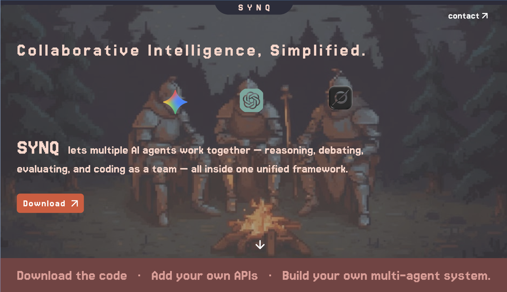

# SYNQ: The Multi-Agent Orchestration Framework

> **Unleash the power of collaborative intelligence.**

<br>

<br>

**SYNQ** is an advanced, open-source framework designed to transcend the limitations of single-model AI. By orchestrating a cohesive team of specialized agents—powered by Gemini, Groq, and OpenRouter—SYNQ enables autonomous reasoning, rigorous debate, creative synthesis, and self-correcting software development.

---

## 🚀 Why SYNQ?

In the rapidly evolving landscape of Artificial Intelligence, no single model is perfect. Some excel at creative nuance, others at strict logic, and others at high-speed code generation.

 **SYNQ unifies them.**

Instead of relying on a solitary output, SYNQ builds a **collaborative ecosystem** where agents challenge, verify, and refine each other's work. The result? Higher accuracy, deeper reasoning, and production-ready code that standard chat interfaces simply cannot match.

## ⚡ Core Capabilities

### 🧠 1. The Consensus Engine
*Don't just get an answer—get the Truth.*
*   **Multi-Model Querying**: Simultaneously polls top-tier models (Gemini 1.5, Llama 3, Mixtral 8x7b).
*   **Mentor-Level Evaluation**: A specialized "Judge" agent strictly scores each response (0-10) on accuracy, depth, and clarity.
*   **Synthesis**: Automatically merges the strongest insights into a single, hallucination-free consensus answer.

### ⚔️ 2. Reality-Grade Debate Simulator
*Simulate complex arguments before they happen.*
*   **Full Debate Structuring**: Orchestrates "PRO" and "CON" agents in a multi-round format (Opening -> Cross-Exam -> Rebuttal -> Closing).
*   **Adversarial Reasoning**: Agents are prompted to be professionally aggressive, exposing logical fallacies and weak assumptions.
*   **Judicial Verdict**: A neutral Judge agent delivers a final, binding verdict based on logical strength and evidence.

### 🎨 3. Universal Creative Studio
*From abstract concept to polished masterpiece.*
*   **The Pipeline**:
    1.  **Master Creator**: Generates high-level concepts, moods, and motifs.
    2.  **Technical Craftsman**: Structures the concept into concrete forms (chapters, verses, code specs).
    3.  **Polishing Director**: Refines flow, emotional impact, and aesthetics for a publish-ready result.

### 💻 4. Autonomous Agentic Coding
*Your 24/7 Software Development Team.*
*   **Full-Cycle Development**: From architectural analysis to written code.
*   **Active QA Loop**: A dedicated QA Engineer agent scans files for syntax errors, broken links, and logic bugs, generating fix tickets automatically.
*   **Runtime Verification**: SYNQ *actually runs your code*. It executes build commands, detects crashes, captures error logs, and **auto-fixes** the code until it runs successfully.

---

## 🛠️ Installation & Setup

### Prerequisites
*   Python 3.8+
*   API Keys for Gemini (Google), Groq, and OpenRouter.

### Quick Start

1.  **Clone the Repository**
    ```bash
    git clone https://github.com/your-username/synq.git
    cd synq
    ```

2.  **Install Dependencies**
    ```bash
    pip install requests google-generativeai
    ```

3.  **Configure API Keys**
    Open `keys.py` and insert your API credentials:
    ```python
    gemini_key = "YOUR_GEMINI_KEY"
    groq_key = "YOUR_GROQ_KEY"
    openrouter_key = "YOUR_OPENROUTER_KEY"
    ```

4.  **Launch SYNQ**
    ```bash
    python v3-multi-mode.py
    ```

---

## 🤝 Contributing

We welcome contributions from the community! Whether you're fixing bugs, adding new agent personas, or integrating new LLM providers, your help is appreciated.

### How to Contribute
1.  **Fork** the repository to your own GitHub account.
2.  **Clone** your fork to your local machine.
3.  **Create a Branch** for your feature or fix (`git checkout -b feature/amazing-agent`).
4.  **Commit** your changes with clear messages.
5.  **Push** to your fork and open a **Pull Request**.

Please ensure your code follows the existing style and includes comments where necessary.

---

*Built with ❤️ for the future of AI.*
